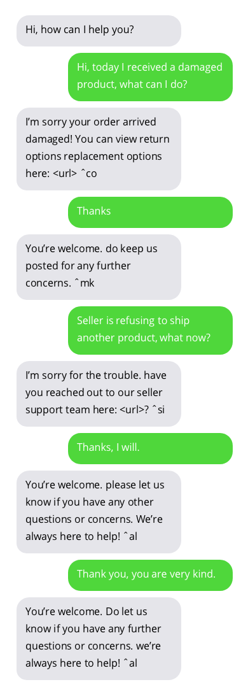
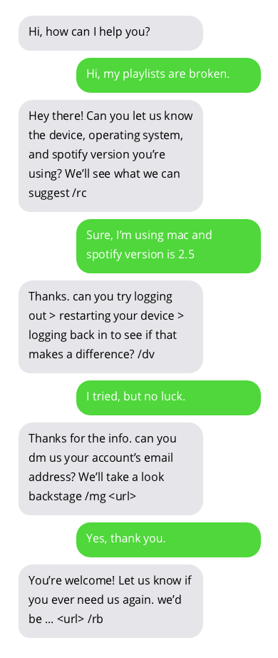

# About
Chatbot is a computer program which conducts a conversation in a human-like way. This project implements chatbot which 
tries to answer users questions as customer support agent. Following customer support chatbots were implemented: 
[AppleSupport](https://twitter.com/AppleSupport), [AmazonHelp](https://twitter.com/AmazonHelp), 
[Uber_Support](https://twitter.com/Uber_Support), [Delta](https://twitter.com/Delta) and 
[SpotifyCares](https://twitter.com/SpotifyCares). Chatbots were trained on publicly available conversations between 
customer supports and users on Twitter.

Chatbot is implemented as sequence to sequence deep learning model with attention. Project is mostly based on 
[Bahdanau et al. 2014](https://arxiv.org/abs/1409.0473), [Luong et al. 2015.](https://arxiv.org/abs/1508.04025) 
and [Vinyals et al., 2015.](https://arxiv.org/abs/1506.05869).

# Sample conversations
Sample conversations with customer support chatbots. Conversations with chatbots are not ideal but show promising 
results. Chatbot answers are in grey bubbles.

## [AppleSupport](https://twitter.com/AppleSupport)

## [AmazonHelp](https://twitter.com/AmazonHelp)

## [Uber_Support](https://twitter.com/Uber_Support)

## [Delta](https://twitter.com/Delta)

## [SpotifyCares](https://twitter.com/SpotifyCares)


# Dataset 
Dataset used for training chatbot can be found 
[here](https://www.kaggle.com/thoughtvector/customer-support-on-twitter/data). This dataset was created by collecting 
publicly available conversations between customer supports and users on Twitter. Many thanks to the author of dataset!

# Try it out!
You can try out chatbot by using pre-trained models or by training your own chatbot.

## Installation 
```bash
pip3 install -r requirements.txt
python3 -m spacy download en
```

## Pre-trained models
Run following commands in root of this repository to download pre-trained customer service chatbots.

```bash
wget https://www.dropbox.com/s/ibm49gx1gefpqju/pretrained-models.zip
unzip pretrained-models.zip
rm pretrained-models.zip
sudo chmod +x predict.py
```

Now you can "talk" with customer service chatbots using `predict.py` script. Following customer service chatbots are 
available: `apple,amazon,uber,delta,spotify`. Following example shows how to run `apple` customer service chatbot:
```bash
./predict.py -cs apple
```

## Train
You can choose to train chatbot yourself. Run following commands to download and format Twitter dataset used in this 
project:
```bash
wget https://www.dropbox.com/s/nmnlcncn7jtb7i9/twcs.zip
unzip twcs.zip
mkdir data
mv twcs.csv data
rm twcs.zip
python3 datasets/twitter_customer_support/format.py # this runs for couple of hours
sudo chmod +x train.py
```
> WARNING this block will run for couple of hours!

Now you can use `train.py` to train chatbot.

# Train script
`train.py` is used for training seq2seq chatbot.
```
usage: train.py [-h] [--max-epochs MAX_EPOCHS] [--gradient-clip GRADIENT_CLIP]
                [--batch-size BATCH_SIZE] [--learning-rate LEARNING_RATE]
                [--train-embeddings] [--save-path SAVE_PATH]
                [--save-every-epoch]
                [--dataset {twitter-applesupport,twitter-amazonhelp,twitter-delta,twitter-spotifycares,twitter-uber_support,twitter-all,twitter-small}]
                [--teacher-forcing-ratio TEACHER_FORCING_RATIO] [--cuda]
                [--multi-gpu]
                [--embedding-type {glove.42B.300d,glove.840B.300d,glove.twitter.27B.25d,glove.twitter.27B.50d,glove.twitter.27B.100d,glove.twitter.27B.200d,glove.6B.50d,glove.6B.100d,glove.6B.200d,glove.6B.300d} | --embedding-size EMBEDDING_SIZE]
                [--encoder-rnn-cell {LSTM,GRU}]
                [--encoder-hidden-size ENCODER_HIDDEN_SIZE]
                [--encoder-num-layers ENCODER_NUM_LAYERS]
                [--encoder-rnn-dropout ENCODER_RNN_DROPOUT]
                [--encoder-bidirectional] [--decoder-type {bahdanau,luong}]
                [--decoder-rnn-cell {LSTM,GRU}]
                [--decoder-hidden-size DECODER_HIDDEN_SIZE]
                [--decoder-num-layers DECODER_NUM_LAYERS]
                [--decoder-rnn-dropout DECODER_RNN_DROPOUT]
                [--luong-attn-hidden-size LUONG_ATTN_HIDDEN_SIZE]
                [--luong-input-feed]
                [--decoder-init-type {zeros,bahdanau,adjust_pad,adjust_all}]
                [--attention-type {none,global,local-m,local-p}]
                [--attention-score {dot,general,concat}]
                [--half-window-size HALF_WINDOW_SIZE]
                [--local-p-hidden-size LOCAL_P_HIDDEN_SIZE]
                [--concat-attention-hidden-size CONCAT_ATTENTION_HIDDEN_SIZE]

Script for training seq2seq chatbot.

optional arguments:
  -h, --help            show this help message and exit
  --max-epochs MAX_EPOCHS
                        Max number of epochs models will be trained.
  --gradient-clip GRADIENT_CLIP
                        Gradient clip value.
  --batch-size BATCH_SIZE
                        Batch size.
  --learning-rate LEARNING_RATE
                        Initial learning rate.
  --train-embeddings    Should gradients be propagated to word embeddings.
  --save-path SAVE_PATH
                        Folder where models (and other configs) will be saved
                        during training.
  --save-every-epoch    Save model every epoch regardless of validation loss.
  --dataset {twitter-applesupport,twitter-amazonhelp,twitter-delta,twitter-spotifycares,twitter-uber_support,twitter-all,twitter-small}
                        Dataset for training model.
  --teacher-forcing-ratio TEACHER_FORCING_RATIO
                        Teacher forcing ratio used in seq2seq models. [0-1]
  --embedding-type {glove.42B.300d,glove.840B.300d,glove.twitter.27B.25d,glove.twitter.27B.50d,glove.twitter.27B.100d,glove.twitter.27B.200d,glove.6B.50d,glove.6B.100d,glove.6B.200d,glove.6B.300d}
                        Pre-trained embeddings type.
  --embedding-size EMBEDDING_SIZE
                        Dimensionality of word embeddings.

GPU:
  GPU related settings.

  --cuda                Use cuda if available.
  --multi-gpu           Use multiple GPUs if available.

Encoder:
  Encoder hyperparameters.

  --encoder-rnn-cell {LSTM,GRU}
                        Encoder RNN cell type.
  --encoder-hidden-size ENCODER_HIDDEN_SIZE
                        Encoder RNN hidden size.
  --encoder-num-layers ENCODER_NUM_LAYERS
                        Encoder RNN number of layers.
  --encoder-rnn-dropout ENCODER_RNN_DROPOUT
                        Encoder RNN dropout probability.
  --encoder-bidirectional
                        Use bidirectional encoder.

Decoder:
  Decoder hyperparameters.

  --decoder-type {bahdanau,luong}
                        Type of the decoder.
  --decoder-rnn-cell {LSTM,GRU}
                        Decoder RNN cell type.
  --decoder-hidden-size DECODER_HIDDEN_SIZE
                        Decoder RNN hidden size.
  --decoder-num-layers DECODER_NUM_LAYERS
                        Decoder RNN number of layers.
  --decoder-rnn-dropout DECODER_RNN_DROPOUT
                        Decoder RNN dropout probability.
  --luong-attn-hidden-size LUONG_ATTN_HIDDEN_SIZE
                        Luong decoder attention hidden projection size
  --luong-input-feed    Whether Luong decoder should use input feeding
                        approach.
  --decoder-init-type {zeros,bahdanau,adjust_pad,adjust_all}
                        Decoder initial RNN hidden state initialization.

Attention:
  Attention hyperparameters.

  --attention-type {none,global,local-m,local-p}
                        Attention type.
  --attention-score {dot,general,concat}
                        Attention score function type.
  --half-window-size HALF_WINDOW_SIZE
                        D parameter from Luong et al. paper. Used only for
                        local attention.
  --local-p-hidden-size LOCAL_P_HIDDEN_SIZE
                        Local-p attention hidden size (used when predicting
                        window position).
  --concat-attention-hidden-size CONCAT_ATTENTION_HIDDEN_SIZE
                        Attention layer hidden size. Used only with concat
                        score function.

```


# Predict script
`predict.py` is used for "talking" to seq2seq chatbot.
```
usage: predict.py [-h] [-cs {apple,amazon,uber,delta,spotify}] [-p MODEL_PATH]
                  [-e EPOCH] [--sampling-strategy {greedy,random,beam_search}]
                  [--max-seq-len MAX_SEQ_LEN] [--cuda]

Script for "talking" with pre-trained chatbot.

optional arguments:
  -h, --help            show this help message and exit
  -cs {apple,amazon,uber,delta,spotify}, --customer-service {apple,amazon,uber,delta,spotify}
  -p MODEL_PATH, --model-path MODEL_PATH
                        Path to directory with model args, vocabulary and pre-
                        trained pytorch models.
  -e EPOCH, --epoch EPOCH
                        Model from this epoch will be loaded.
  --sampling-strategy {greedy,random,beam_search}
                        Strategy for sampling output sequence.
  --max-seq-len MAX_SEQ_LEN
                        Maximum length for output sequence.
  --cuda                Use cuda if available.
```
